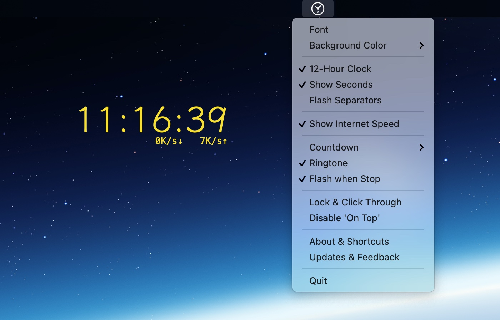

### **zClock** (Desktop Clock, Net Monitor & CountDown) 
[🇨🇳中文](./index.html)  ｜ [🇺🇸English](./en.html)

### Topmost Clock, Net Speed Monitor

### Countdown

### Feature
1. On the top of any other fullscreen App.
1. Clock.
4. Keynote Countdown.
3. Net Monitor.

### Download
* [【 zClock Lite 】](https://apps.apple.com/us/app/zclock-lite/id1489475245)
* [【 zClock Full Edition 】](https://apps.apple.com/us/app/zclock/id1478540997)
   * More features:
       * Custom font, size, color.
       * Show second, Support 12-Hour format.
       * Countdown ringtone, Custom coundown duration.
       * Lock and Click Through.
       * Disable topmost.
* [【 Windows V0.3.2 】](https://zclock.oss-cn-shenzhen.aliyuncs.com/win/0.3.2/zClock-v0.3.2.zip) *md5: b15481ea367f7785f6bd71e21ad718ad*

### Auto Launch
* Open **System Preferences > Users & Groups > Login Items**, Add **zClock** into "Login Items"

### Feedback   

* [E-mail](mailto:hooper.zhu@gmail.com)

---
*Don't Worry, it's not a big deal, time will dilute all.*
