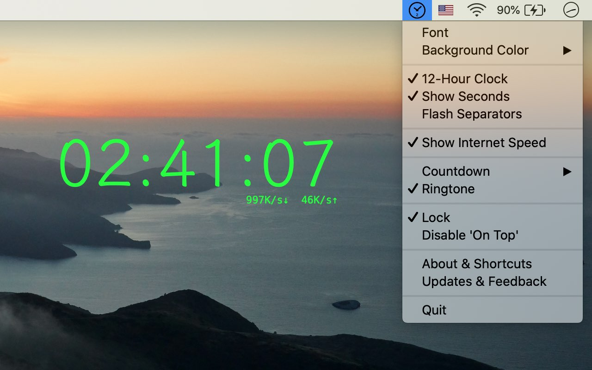

### **zClock** (Desktop Clock, Net Monitor & CountDown) 
[🇨🇳中文](./index.html)  ｜ [🇺🇸English](./en.html)

### Download
* zClock Lite -> [【Free Edition Download】](https://apps.apple.com/us/app/zclock-lite/id1489475245)
* zClock ->  [【Full Edition Download】](https://apps.apple.com/us/app/zclock/id1478540997)
* Windows -> [【V0.3.2 Download】](https://zclock.oss-cn-shenzhen.aliyuncs.com/win/0.3.2/zClock-v0.3.2.zip)
    * zip md5:  b15481ea367f7785f6bd71e21ad718ad

### Preview

### Feature
1. On the top of any other fullscreen App.
1. Clock.
4. Keynote Countdown.
3. Net Monitor.

### Auto Launch
* Open **System Preferences > Users & Groups > Login Items**, Add **zClock** into "Login Items"

### Contact   

* [E-mail](mailto:hooper.zhu@gmail.com)

---
*Don't Worry, it's not a big deal, time will dilute all.*
