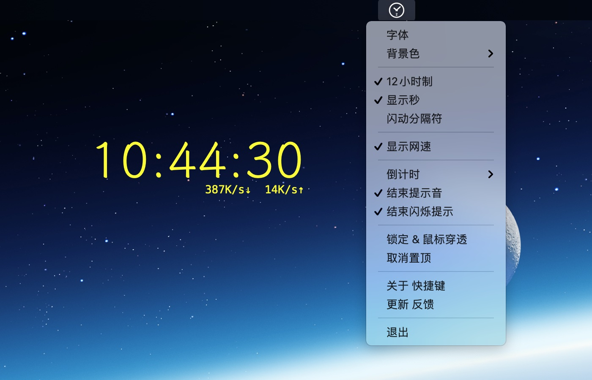

### zClock(桌面置顶时钟，倒计时，网速显示) 
[🇨🇳中文](./index.html)  ｜ [🇺🇸English](./en.html)

### 置顶时钟，网速显示

### 置顶倒计时

### 功能
1. 在**任何应用全屏状态顶端显示**.(支持鼠标穿透).
2. **时钟**, 可选是否置顶, 12/24小时制。
3. **倒计时**, 自定义时长. 结束提示音.
4. **显示网速**.
5. 自定义大小, 字体颜色.

### 下载
* [【 zClock Lite 免费版 】](https://apps.apple.com/cn/app/zclock-lite/id1489475245)
* [【 zClock 完整版 】](https://apps.apple.com/cn/app/zclock/id1478540997)
* [【 Windows v0.3.2 】](https://zclock.oss-cn-shenzhen.aliyuncs.com/win/0.3.2/zClock-v0.3.2.zip) *md5:  b15481ea367f7785f6bd71e21ad718ad*

### 开机自启动
* **系统偏好设置>>用户与群组>>登录项** 在其中添加**zClock**即可

### 反馈   
* [ 【 反馈 】 ](https://support.qq.com/product/72603)  

---
*不用担心，没什么大不了的，时间会抚平一切。*
